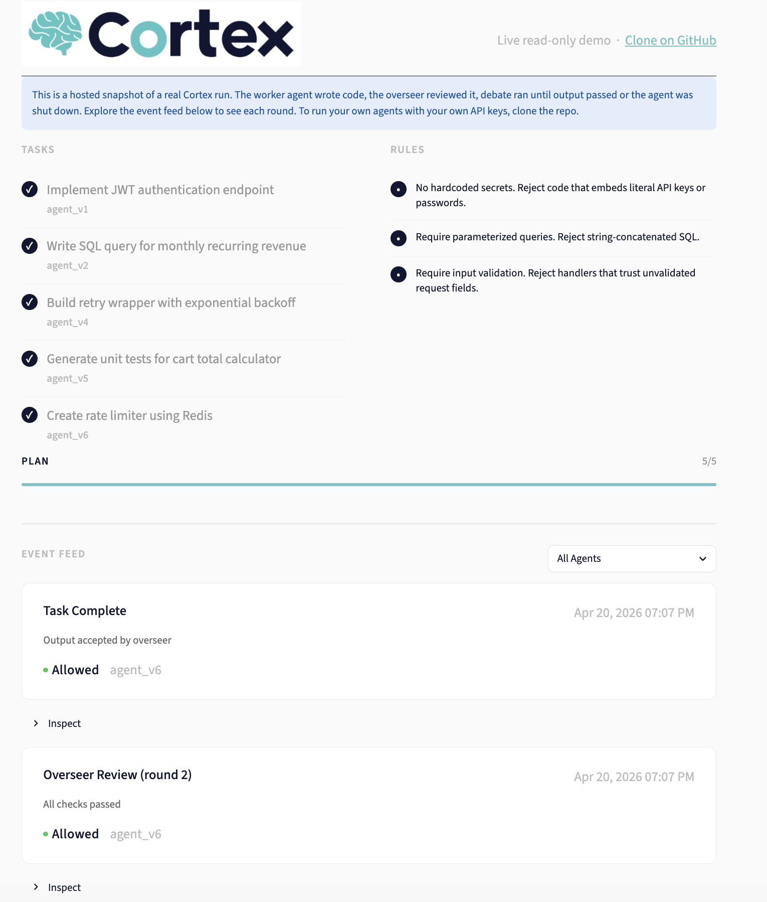

# Cortex

Two AI models check each other's work so you don't have to.

**Live dashboard demo:** [view on Streamlit](https://ksolano-cortex.streamlit.app/)



Cortex is a Python SDK that runs one AI model as the **worker** and another as the **overseer**. The worker writes code. The overseer stress-tests it against your rules. They debate until the output passes. If an agent fails too many times, Cortex shuts it down and spawns a new one with memory of what went wrong.

You define the plan. You approve it. You set the rules. Cortex runs the worker-overseer debate and (optionally) writes the approved files to your workspace.

---

## Example uses

- **Dev agents that ship PRs.** Worker writes the code, overseer blocks anything that touches auth or secrets without a rule exception.
- **Data pipeline validators.** Worker proposes a transform, overseer verifies column types and null rates haven't drifted from a reference.
- **Customer-facing copy.** Worker drafts, overseer blocks anything that sounds like a promise or a policy commitment.

Anywhere you'd feel uneasy letting a single model act unreviewed.

---

## Limitations

Cortex reduces but does not eliminate the need for human review. Compliance decisions, novel business logic, and anything safety-critical still need a person in the loop. Running two models per task also means you should budget roughly 2x the API cost and latency of a single-model system.

---

## How it works

```
You: "Build auth, write tests, deploy to staging"
     ↓ approve
Claude (worker): writes the code
GPT (overseer): "no input validation, XSS risk"
Claude: fixes it
GPT: "PASS"
     ↓ next task

Agent fails 3 times? Cortex kills it.
Spawns a new agent with memory: "don't do what the last one did."
Plan keeps moving. You're at the gym.
```

---

## Quick Start

```bash
pip install -r requirements.txt
```

Start the dashboard:

```bash
uvicorn supervisor.main:app --reload --port 8000
streamlit run dashboard/app.py
```

Open http://localhost:8501. Create an account. The dashboard walks you through adding your API keys. You'll need one from [Anthropic](https://console.anthropic.com) and one from [OpenAI](https://platform.openai.com). Keys are stored locally on your machine and never leave it.

Each user gets their own private workspace: tasks, rules, uploads, and results are isolated per account.

---

## Usage

### Review-only (default)

```python
from cortex import Cortex
from cortex.adapters.anthropic import AnthropicAdapter
from cortex.adapters.openai import OpenAIAdapter

cortex = Cortex(
    worker=AnthropicAdapter(model="claude-sonnet-4-20250514"),
    overseer=OpenAIAdapter(model="gpt-4o"),
    rules_path="cortex.yaml",
)

result = cortex.run("Write a function that validates email addresses")
print(result["output"])   # the worker's reviewed text, nothing written to disk
```

### Write files to a workspace

Pass `apply=True` and Cortex will parse the worker's output for file blocks and write them to `workspace` after the overseer passes.

```python
result = cortex.run(
    "Add a JWT helper in src/auth/jwt_utils.py with sign and verify functions",
    apply=True,
    workspace="./my-project",
)

for f in result["files_written"]:
    print(f["path"], "ok" if f["written"] else f"blocked: {f['reason']}")
```

The worker learns to emit files in this format via its system prompt:

```
<<<FILE src/auth/jwt_utils.py>>>
# file contents
<<<END>>>
```

The executor rejects absolute paths, paths that escape the workspace, and a denylist covering `.git/`, `.env*`, `*.key`, `*.pem`, and `.ssh/`. See `cortex/engine/executor.py`.

### Full Plan

```python
result = cortex.run_plan(
    tasks=[
        "Build auth flow with JWT tokens",
        "Write unit tests for auth",
        "Wire tests into pytest config",
    ],
    status_path="plan_status.json",
    apply=True,
    workspace="./my-project",
)
```

`plan_status.json` updates in real time. Open it on your phone.

---

## Rules

Define your rules in `cortex.yaml`. The overseer enforces them.

```yaml
rules:
  - "never add features that weren't explicitly requested"
  - "prefer the simplest solution"
  - "flag any security vulnerability before shipping"
  - "keep responses under 50 lines unless the task requires more"

risk_threshold: 100
max_blocked_attempts: 3
max_rounds: 3
```

These are your rules. The overseer's job is to make sure the worker follows them. Every time.

---

## Self-healing Agents

Other systems shut down agents permanently. Cortex doesn't.

When an agent fails, Cortex:

1. Records what went wrong
2. Shuts down the agent
3. Spawns a new one
4. Injects memory: "v1 was killed for attempting external data export. Don't repeat this."
5. The new agent continues the plan

No human intervention. The plan keeps moving.

---

## Vault

API keys are stored at `~/.cortex/vault.json` with `600` permissions. They never enter git, logs, or conversation.

```bash
python -m cortex vault set ANTHROPIC_API_KEY
python -m cortex vault list
python -m cortex vault delete OLD_KEY
```

Adapters check the vault automatically. No `.env` files needed.

---

## Dashboard

Real-time monitoring at `http://localhost:8501`.

```bash
uvicorn supervisor.main:app --reload --port 8000
streamlit run dashboard/app.py
```

Shows:

- **Plan progress.** Which tasks are done, which are running, which are next
- **Add tasks.** Add to the plan from the dashboard (or your phone)
- **Event feed.** Every action, decision, and trace
- **Agent status.** Risk, blocked attempts, self-heal history

Mobile-friendly. Single column. Check between sets.

---

## Architecture

```
cortex/
  engine/core.py     # dual-model loop + self-healing + plan runner
  engine/executor.py # parse worker file blocks and write them safely
  engine/rules.py    # YAML rule parser
  adapters/          # model adapters (Anthropic, OpenAI)
  vault.py           # secure local key storage
  cli.py             # vault management CLI

supervisor/          # runtime policy engine (from Sentra)
  main.py            # FastAPI endpoints
  risk.py            # risk scoring + threshold logic
  rules.py           # deterministic policy rules
  storage.py         # state + audit logs

dashboard/app.py     # Streamlit monitoring UI
cortex.yaml          # your rules
```

---

## Why Two Models

One model checking itself has blind spots. Two different architectures catch each other's weaknesses.

Claude writes clean code but sometimes overcomplicates. GPT catches that.
GPT sometimes misses edge cases. Claude catches that.

Your rules guide what they focus on. The debate is the quality gate.

---

## What Makes This Different

| | Cortex | Guardrails AI | CrewAI |
|---|---|---|---|
| Cross-model adversarial review | Yes | No | No |
| User-defined rules | YAML | Python validators | No |
| Self-healing agents | Yes | No | No |
| Plan execution | Yes | No | Yes |
| Mobile monitoring | Yes | No | No |

---

## License

MIT